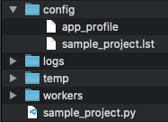

## Directory Structure
As described in the Quick Start, the directory structure and minimally required files can be automatically generated via (`logs` and `temp` generated at first run):

```bash
pyrunner --setup
```

This will create the following project structure:



## config Directory
The default directory in which the [app_profile](./app_profile.md) and [.lst file](./lst_file.md) files are created.

This path can be referenced by env var `${APP_CONFIG_DIR}`.

## logs Directory
The root log directory referenced by env var `${APP_ROOT_LOG_DIR}`.

By default, logs will be written to a sub-directory named as the current date: `${APP_ROOT_LOG_DIR}/YYYY-MM-DD`

This date-stamped sub-directory path can be referenced by env var `${APP_LOG_DIR}`.

## worker Directory
Default location to store PyRunner Worker class implementations. All workers given in the .lst file (or driver program) are expected to be found in this directory.

This path can be referenced by env var `${APP_WORKER_DIR}`.

## temp Directory
Default location for intermediate or checkpoint files generated by PyRunner.

This path can be referenced by env var `${APP_TEMP_DIR}`.